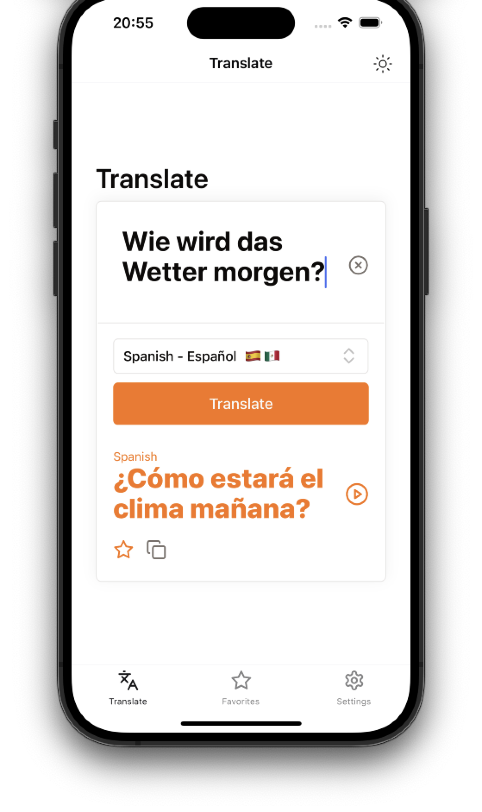
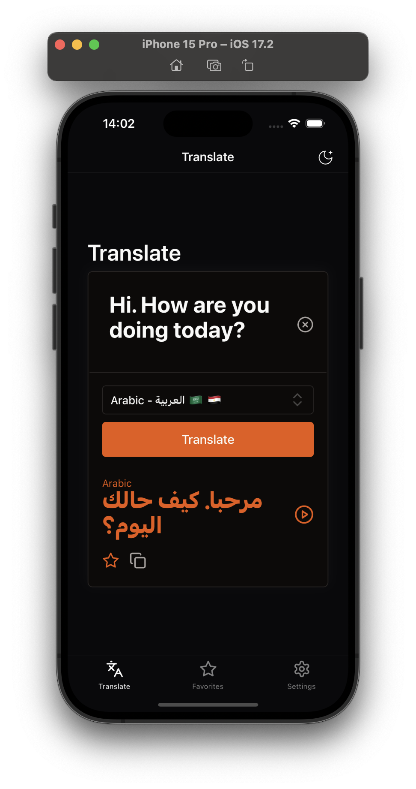
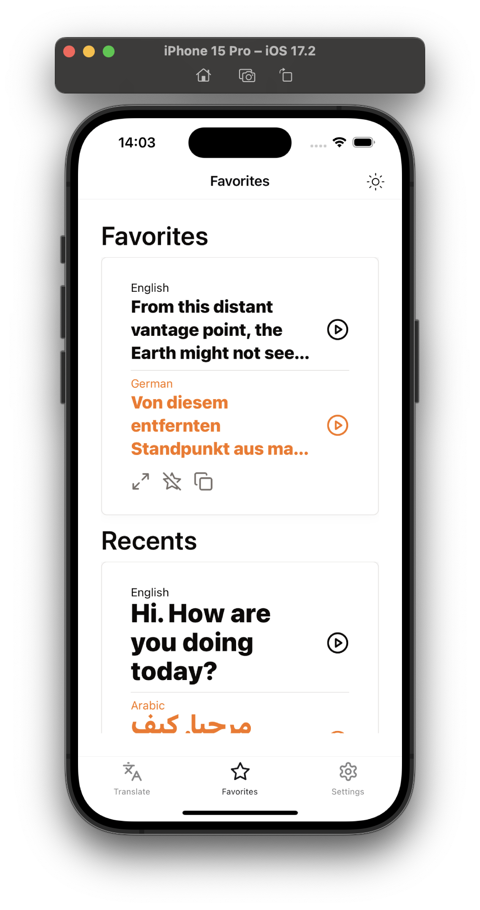
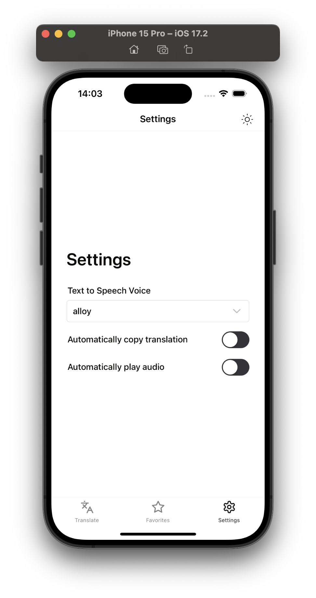

  
  <h1 align="center">GPT Translate</h1>
  

    <h3 style="max-width: 300px">Proof of concept for a translation app using Large Language Models.</h3>
  

A React Native app that uses a Large Language Model (e.g. OpenAI's GPT-3) to translate text from one language to another. It uses OpenAI's Text-To-Speech API to read the translated text out loud. The app uses Expo and is written in TypeScript. A simple backend proxy is used to make the API calls to OpenAI. The backend is written in Node.js using Fastify.

 
<small>Note: This app is a proof of concept and not intended for production use. I developed it to learn more about React Native and to experiment with LLMs.</small>

## Features

- translate (almost) every language to every language
- read the translated text out loud using different voices (powered by OpenAI's Text-To-Speech API)
- save favorite translations
- copy and share translations
- light/dark mode
- supports iOS and Android (no platform specific code)

  
  
  
  

## Setup

### Backend

Create a `.env` file in the `backend` directory with the `API_KEY` for OpenAI. Have a look at the `.env.example` file.

### App

Create a `.env` file in the root directory with the urls for the backend. Have a look at the `.env.example` file.

For iOS use the `EXPO_PUBLIC_API_URL_IOS` variable. For Android use the `EXPO_PUBLIC_API_URL_ANDROID` variable.

## Run

### Backend

Go to the `backend` directory.

`npm install`

`npm run build && npm run start`

### App

`npm install`

`npx expo start`

# Tech Stack

App:

- React Native with [Expo](https://expo.dev/)
- components by [React Native Reusables](https://github.com/mrzachnugent/react-native-reusables)
- TypeScript

Backend:

- [Fastify](https://fastify.dev/)
- OpenAI [Node.js library](https://github.com/openai/openai-node)
- TypeScript
